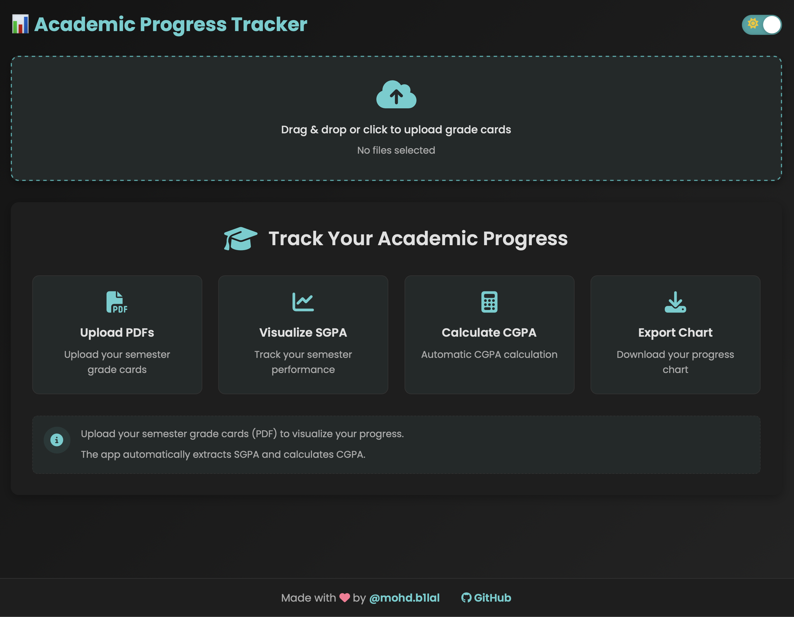
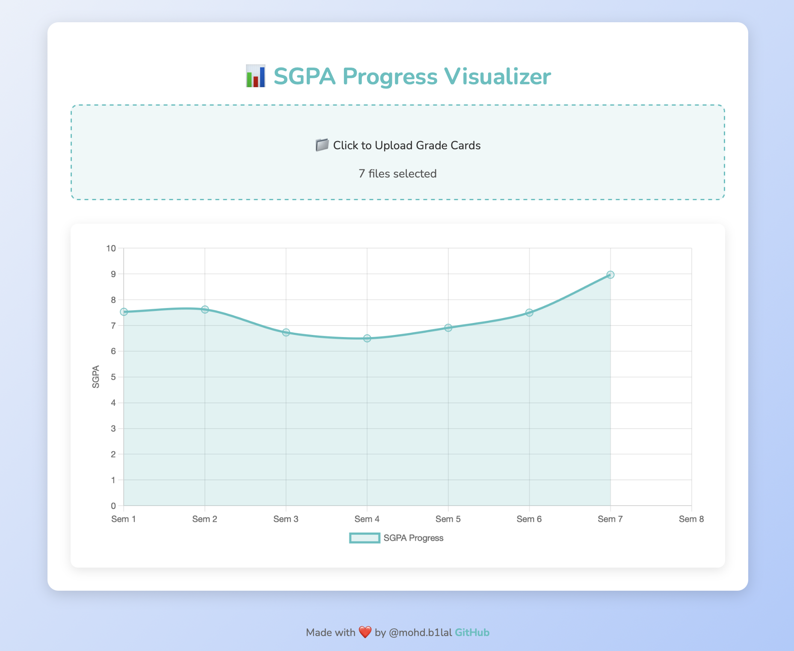

# 📊 SGPA Visualizer - Your Academic Progress Tracker 🚀

Welcome to the **SGPA Visualizer**, a fun and interactive tool to track your academic progress! Whether you're a student, professor, or just curious about your grades, this app will help you visualize your SGPA trends across semesters. Let's dive in! 🎉

---

## 🌟 Features

- **📁 Drag & Drop PDF Upload**: Easily upload your grade cards in PDF format.
- **📈 Interactive Charts**: Beautiful line charts to visualize your SGPA progress.
- **🎨 Modern UI**: Sleek design with smooth animations and responsive layout.
- **🔍 Automatic Semester Detection**: The app detects your semester from the PDF.
- **📱 Mobile-Friendly**: Works seamlessly on all devices.
- **🚀 Fast & Efficient**: Built with Flask and Chart.js for a smooth experience.

---

## 🛠️ Tech Stack

- **Frontend**: HTML5, CSS3, JavaScript, Chart.js
- **Backend**: Python, Flask
- **PDF Processing**: PyMuPDF (Fitz)
- **Hosting**: PythonAnywhere

---

## 📂 File Directory Structure

Here’s how the project is organized:

```
sgpa-visualizer/
├── app/                  # Backend logic
│   ├── __init__.py       # Flask app initialization
│   ├── routes.py         # API routes and handlers
│   ├── pdf_processor.py  # PDF processing logic
├── static/               # Static files (CSS, JS, images)
│   └── styles.css        # Styling for the app
├── static/
│   └── screenshot1.png   #Interface
│   └── screenshot2.png   #Chart
├── templates/            # HTML templates
│   └── index.html        # Main page
├── config.py             # Configuration settings
├── requirements.txt      # Python dependencies
├── README.md             # You're reading it! 😄
└── LICENSE               # MIT License
```

---

## 🚀 How to Run This Program

### **Prerequisites**

- Python 3.8+
- Git (optional)

### **Step 1: Clone the Repository**

```bash
git clone https://github.com/mohdb1lal/sgpa-visualizer.git
cd sgpa-visualizer
```

### **Step 2: Set Up Virtual Environment**

```bash
python -m venv venv
source venv/bin/activate  # On Windows: venv\Scripts\activate
```

### **Step 3: Install Dependencies**

```bash
pip install -r requirements.txt
```

### **Step 4: Run the Application**

```bash
flask run
```

### **Step 5: Open in Browser**

Visit [http://localhost:5000](http://localhost:5000) in your browser.

---

## 🌐 Live Demo

Check out the live version of the app here:  
👉 [Click here](http://cplab2022.pythonanywhere.com)

---

## 📸 Adding Screenshots

To make your project more engaging, add screenshots of your app in action! Here's how:

1. Take screenshots of your app (e.g., the upload page, chart visualization).
2. Save them in a folder named `screenshots/` in your project root.
3. Add them to your README using Markdown:

```markdown


```

---

## 🛠️ How to Contribute

We welcome contributions! Here's how you can help:

1. **Fork the Repository**: Click the "Fork" button on GitHub.
2. **Create a Branch**:
   ```bash
   git checkout -b feature/your-feature-name
   ```
3. **Make Your Changes**: Add your awesome code or fixes.
4. **Commit and Push**:
   ```bash
   git commit -m "Add your message here"
   git push origin feature/your-feature-name
   ```
5. **Open a Pull Request**: Describe your changes and submit!

---

## 📜 License

This project is licensed under the MIT License. See the [LICENSE](LICENSE) file for details.

---

## 🙏 Acknowledgments

- **Chart.js** for beautiful visualizations.
- **PyMuPDF** for PDF processing magic.
- **PythonAnywhere** for free hosting.
- **You** for checking out this project! 😊

---

## 💬 Feedback

Have questions or suggestions? Feel free to:

- Open an issue on [GitHub](https://github.com/mohdb1lal/sgpa-visualizer/issues).
- Reach out to me at [btechfolks](mailto:btechfolks@gmail.com).

---

## 🎉 Happy Coding!

Now go ahead, track your SGPA, and ace your semesters! 🚀
